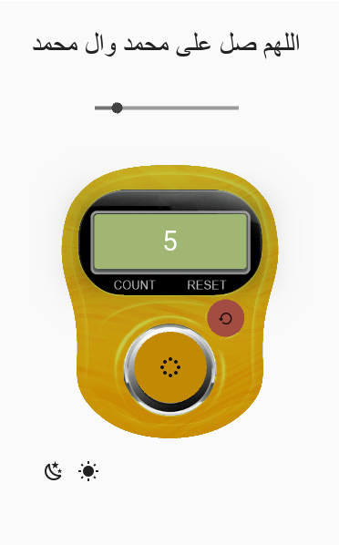
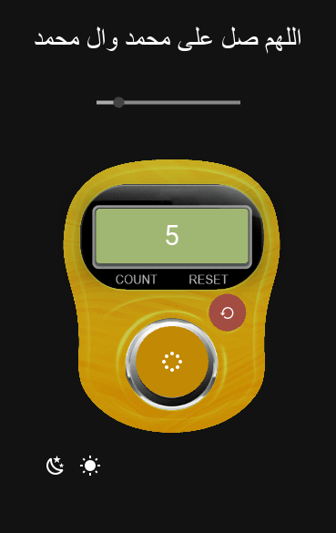
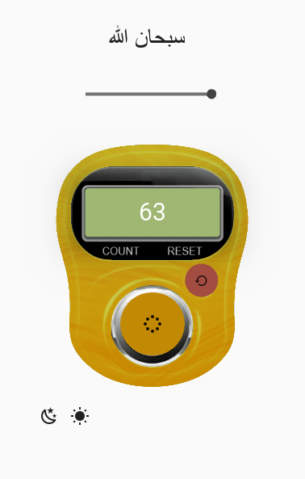
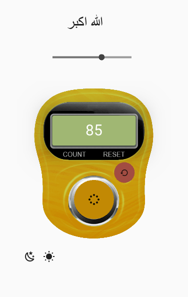

# 🕌 Smart Digital Tasbeeh

## 📌 About
A *smart electronic Tasbeeh app* designed for easy use.  
- ✅ Tracks your Tasbeeh count  
- ✅ Can reset to zero after completing a Tasbeeh session  
- ✅ User-friendly interface  
- ✅ High-quality design  

---

## 🚀 Features
- Reset function to start a new Tasbeeh session  
- Count tracking  
- Simple and elegant interface  
- Suitable for all users  

---

## 📷 Screenshots
| Screen 1 | Screen 2 |
|----------|----------|
|  |  |

| Screen 3 | Screen 4 |
|----------|----------|
|  |  |

> *Note:* This program is currently *under development*.

---

## 🛠️ Technologies Used
- [Python 3](https://www.python.org/)  
- [Kivy](https://kivy.org/)  
- [KivyMD](https://kivymd.readthedocs.io/)  

---

